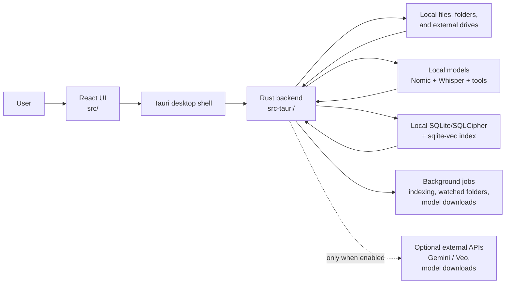

# Cosmos OSS

Cosmos OSS is a cross-platform desktop application for local-first, AI-assisted file search. It combines a fast Tauri shell, a React UI, and a Rust backend that runs multimodal models (Nomic embeddings + Whisper) entirely on your machine. No telemetry, no proprietary endpoints—everything stays on disk unless you explicitly connect an external API like Google Gemini.

## Why open-source Cosmos?
- **Privacy by default:** All indexing, embeddings, and transcription run locally. There are no hidden HTTP calls or analytics beacons.
- **Portable architecture:** Tauri enables identical builds for macOS, Windows, and Linux with a single Rust/TypeScript codebase.
- **Extensible search:** The same pipeline handles images, videos, and documents so contributors can plug in new model backends or file handlers.
- **Community plugins:** The built-in “App Store” UI simply stores user-provided API keys (e.g., Gemini/Veo). You decide which external services to enable.

## Snapshot of capabilities
- Offline multimodal indexer built on FastEmbed (Nomic `nomic-embed-text-v1.5` + `nomic-embed-vision-v1.5`).
- Vector + metadata search backed by SQLite/SQLCipher with `sqlite-vec` acceleration.
- Chunk-level semantic text indexing for local documents (`txt`, `md`, `json`, `csv`, `log`, `xml`, `yml`, `yaml`, `toml`, `ini`, `conf`, `rtf`, `pdf`).
- Optional Whisper-base transcription for audio clips.
- Video generation helpers (Gemini/Veo3) once you add your own API key.
- Quick menu for managing downloads, checking GPU availability, and packaging diagnostic logs.

## How It Works

Cosmos OSS is a local desktop app, not a hosted service. The React frontend handles the UI, Tauri provides the desktop shell and native windowing, and the Rust backend does the heavy lifting for indexing, search, file operations, model management, and media processing.

### Architecture at a glance



### 1. You choose what Cosmos can see
- Cosmos does not crawl your whole machine by default.
- You explicitly point it at folders, drives, or watched folders from the UI.
- The backend keeps track of indexed paths, watched folders, and external drive metadata so disconnected drives can still appear in the library.

### 2. Files are analyzed locally
- Images and videos are processed into visual embeddings using local Nomic/FastEmbed models.
- Text documents are split into chunks and embedded for semantic text retrieval.
- Audio or video can optionally be transcribed with Whisper, and those transcripts become searchable too.
- Supporting tools like FFmpeg and `pdftotext` are used locally when needed.

### 3. Search data is stored in a local encrypted database
- Cosmos stores metadata, text chunks, transcripts, job state, and vector indexes in local SQLite/SQLCipher-backed storage.
- Semantic search uses `sqlite-vec` tables for embedding similarity lookup.
- The app keeps enough metadata around to reopen files, show previews, and reconnect offline drive content later.

### 4. Search is semantic, not just filename matching
- Text search embeds your query and compares it against embedded document chunks.
- Visual search compares images against previously indexed visual embeddings.
- The UI then combines those ranked results with file metadata and previews so you can inspect or open matches quickly.

### 5. Background jobs keep the index fresh
- Indexing runs through backend job queues instead of blocking the UI.
- Watched folders can automatically pick up new or changed files and queue them for indexing.
- The Quick Menu and Settings screens expose model download state, index health, job progress, and diagnostic tools.

### 6. External APIs are optional and explicit
- Core indexing and search work fully offline once models are available.
- Network access only happens when you choose features that need it, such as downloading models or adding a third-party integration like Gemini/Veo.
- The built-in App Store is really a local integration manager for user-supplied keys, not a cloud dependency.

### End-to-end flow
1. Pick a folder or watched folder.
2. Cosmos scans files and extracts text/media features locally.
3. Embeddings, metadata, and transcripts are written to the local database.
4. You search with text or an image.
5. Cosmos runs semantic retrieval locally and returns ranked results in the desktop UI.

For deeper diagrams, see [docs/ARCHITECTURE.md](docs/ARCHITECTURE.md).

## Repository layout
| Path | Description |
| ---- | ----------- |
| `src/` | React + Tailwind UI, contexts, and feature modules |
| `src-tauri/` | Rust backend (commands, services, model loaders) |
| `docs/` | Build guide, roadmap, contributing, code of conduct, security |
| `docs/ARCHITECTURE.md` | Mermaid diagrams for system, indexing, and search flows |
| `docs/THIRD_PARTY_NOTICES.md` | Third-party binary/model attribution guidance |
| `scripts/` | *(intentionally empty—release scripts lived in the private repo)* |

## Run Cosmos

Today there are only two supported ways to use Cosmos OSS:
- build it from source
- download the published macOS DMG from GitHub Releases

There is no separate download website, hosted updater feed, or external distribution channel yet.

### 1. Download the DMG from GitHub
1. Open [GitHub Releases](https://github.com/cosmos-oss/cosmos-oss/releases).
2. Download the latest macOS `.dmg`.
3. Drag Cosmos into `Applications`, then launch it.
4. On first launch, use **Quick Menu → Manage Models** to download models.

### 2. Build from source
Use this path if you want to develop, customize, or run unreleased code.

## Prerequisites (build from source)
- **Node.js** 20.x and **pnpm** 9.x (install via `corepack enable` or `npm install -g pnpm`).
- **Rust** stable toolchain (`rustup default stable`) plus the [Tauri prerequisites](https://tauri.app/v1/guides/getting-started/prerequisites) for your OS (Xcode CLT on macOS, Visual Studio Build Tools on Windows, `libgtk-3-dev` et al. on Linux).
- **FFmpeg binaries** in `src-tauri/bin` (run `pnpm bootstrap:assets:ffmpeg` to fetch them automatically).
- **Poppler `pdftotext`** on `$PATH` if you want PDF text indexing.
- **Git LFS** if you plan to check in large sample assets.

## Quick start (option 2: build from source)
```bash
# 1. Clone the public repo
git clone https://github.com/cosmos-oss/cosmos-oss.git
cd cosmos-oss

# 2. Install JS deps
pnpm install

# 2b. Optional: prefetch FFmpeg + model files now (instead of first launch)
pnpm bootstrap:assets

# 3. Run the desktop dev shell (Vite + Tauri dev tools)
pnpm dev
```
When the window opens:
1. Use **Quick Menu → Manage Models** to download the Nomic + Whisper artifacts (or drop files directly in `~/Library/Application Support/cosmos/models` on macOS and the analogous AppData path on Windows).
2. Start indexing folders from the sidebar and try visual/text search immediately.

For full build details and platform-specific packaging, see [`docs/BUILDING.md`](docs/BUILDING.md).

### Optional install-time bootstrap
`postinstall` is wired but opt-in only. To auto-run bootstrap during `pnpm install`, set:
```bash
COSMOS_BOOTSTRAP_ASSETS=1 pnpm install
```
You can also run focused commands:
- `pnpm bootstrap:assets:ffmpeg`
- `pnpm bootstrap:assets:models`

## Building signed binaries
Detailed walkthroughs live in [`docs/BUILDING.md`](docs/BUILDING.md). At a glance:
```bash
# Secure public macOS release (sign + notarize + audit)
pnpm release:production

# Same, then upload artifacts to a GitHub release tag
pnpm release:production:upload -- --tag v0.1.1 --repo golivecosmos/cosmos-oss

# Windows MSI (requires the Windows build tools shell)
pnpm tauri build --target x86_64-pc-windows-msvc

# Linux AppImage / deb
pnpm tauri build --target x86_64-unknown-linux-gnu
```
At the moment, only the macOS DMG is published publicly, and it is published on GitHub Releases. Windows and Linux users should build from source until hosted packages exist for those platforms.

The default bundle identifier is `com.cosmos.oss`. The release flow now reads the macOS signing identity from `APPLE_SIGNING_IDENTITY` instead of hardcoding it in `src-tauri/tauri.conf*.json`.

## Model registry configuration
Cosmos ships with Hugging Face URLs, but every model path can be overridden without recompiling:

| Env var | Default | Purpose |
| ------- | ------- | ------- |
| `COSMOS_MODEL_BASE_URL` | `https://huggingface.co` | Base registry host |
| `COSMOS_MODEL_NAMESPACE` | `nomic-ai` | Org/namespace |
| `COSMOS_TEXT_MODEL_SLUG` | `nomic-embed-text-v1.5/resolve/main` | Text model folder |
| `COSMOS_VISION_MODEL_SLUG` | `nomic-embed-vision-v1.5/resolve/main` | Vision model folder |

Set them before launching (`COSMOS_MODEL_BASE_URL=https://my.mirror pnpm dev`) to mirror artifacts behind a firewall.

## Semantic Text Search (Hard-Cutover Mode)
- Text search uses strict embedding retrieval over chunk vectors (`text_chunks` + `vec_text_chunks`).
- Query embedding prefix: `search_query:`.
- Document chunk embedding prefix: `search_document:`.
- No filename fallback path is used when semantic text search fails.

If you are upgrading from an older local database, reindex your files after pulling this version so text chunk vectors are populated.

## Optional integrations
- **Gemini 2.5 + Veo3** video generation: open **Settings → App Store**, install “Google Gemini,” and paste your API key. The backend validates keys by calling `https://generativelanguage.googleapis.com/v1beta` directly; nothing is proxied.
- **Future connectors** (Stable Diffusion, local LoRA hosts, etc.) can be added through the App Installation service inside `src-tauri/src/services/app_installation_service.rs`.

## Privacy & telemetry stance
- No analytics SDKs, crash reporters, or remote logging remain in the tree.
- Error reports stay local; the UI simply packages logs into a zip that you can attach to an issue.
- Network access occurs **only** when you opt-in (model downloads, Gemini API usage, OS-level update checks if you re-enable them).

## Roadmap highlights
- **Tauri 2 migration** (multi-window, sidecar improvements) — see [`docs/ROADMAP.md`](docs/ROADMAP.md).
- **Model hot-swapping** so contributors can bring their own ONNX/Candle checkpoints without forking.
- **Plugin marketplace** driven by signed manifests instead of hardcoded “App Store” entries.

## Contributing
1. Read [`docs/CONTRIBUTING.md`](docs/CONTRIBUTING.md) for style, linting, and testing guidance.
2. Open an issue describing the change or pick a `good first issue` label.
3. For large or risky work (model backends, database migrations), coordinate through GitHub Discussions before raising a PR.

## Security
If you discover a vulnerability, please follow [`docs/SECURITY.md`](docs/SECURITY.md) and create a private advisory. Cosmos OSS has no backend, but we still want responsible disclosure for filesystem or model-loading issues.

## License
This project is released under the [MIT License](LICENSE). By contributing, you agree that your contributions will be licensed under MIT as well.

For bundled dependencies (FFmpeg/ONNX runtime/model artifacts), see [Third-Party Notices](docs/THIRD_PARTY_NOTICES.md).
