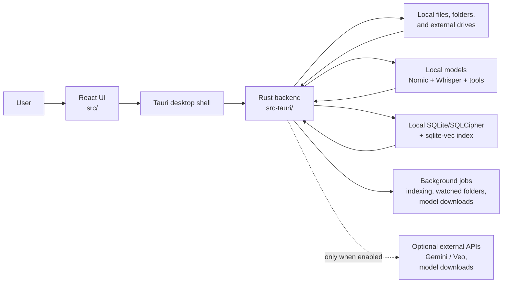
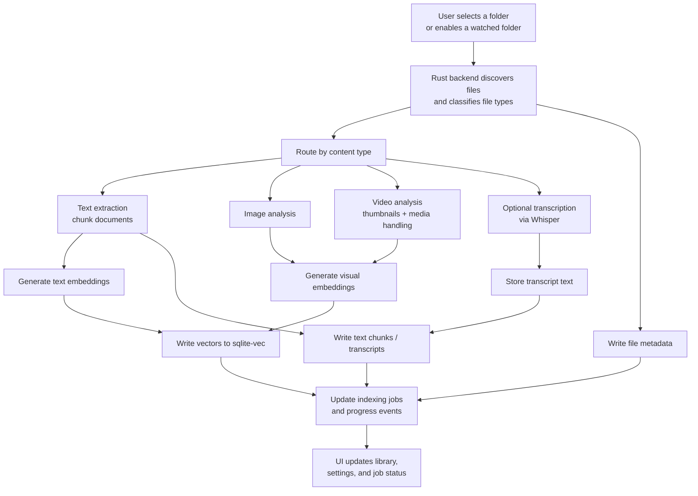
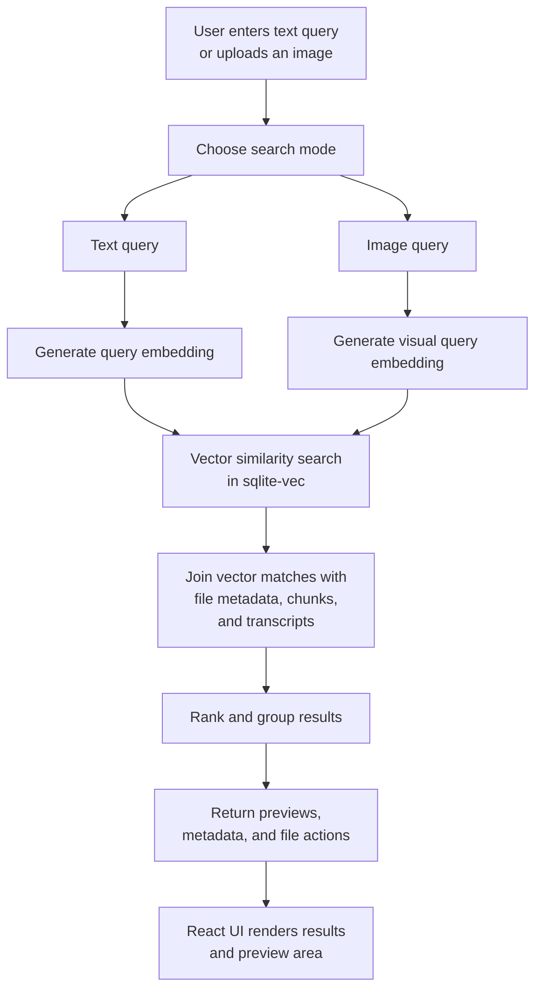

# Cosmos OSS Architecture

This document explains the main runtime flows in Cosmos OSS using Mermaid diagrams. It is intended for contributors and advanced users who want to understand how the desktop app is structured internally.

## 1. High-Level Architecture

## 2. Indexing Pipeline

## 3. Search Pipeline

## Notes

- Cosmos OSS is local-first. Core indexing and search run on-device.
- External network access is optional and mostly limited to model downloads or user-enabled integrations.
- The UI is intentionally thin compared to the backend; most indexing, search, media processing, and persistence logic lives in Rust.
